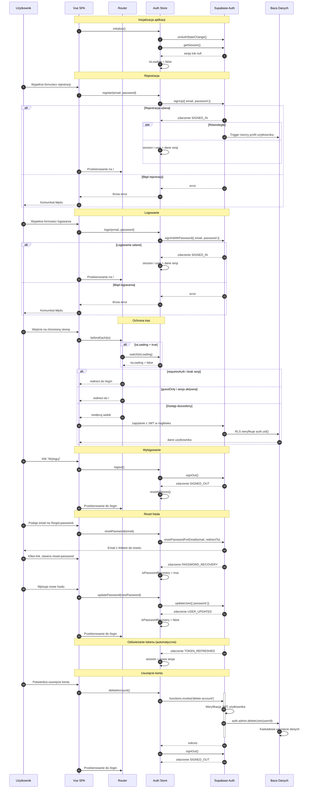

# Diagram sekwencji - Przepływ autentykacji

```mermaid
sequenceDiagram
    autonumber
    participant U as Użytkownik
    participant V as Vue SPA
    participant R as Router
    participant AS as Auth Store
    participant SA as Supabase Auth
    participant DB as Baza Danych

    Note over V,SA: Inicjalizacja aplikacji
    V->>AS: initialize()
    AS->>SA: onAuthStateChange()
    AS->>SA: getSession()
    SA-->>AS: sesja lub null
    AS->>AS: isLoading = false

    Note over V,SA: Rejestracja
    U->>V: Wypełnia formularz rejestracji
    V->>AS: register(email, password)
    AS->>SA: signUp({ email, password })
    alt Rejestracja udana
        SA-->>AS: zdarzenie SIGNED_IN
        par Równolegle
            SA->>DB: Trigger tworzy profil użytkownika
        and
            AS->>AS: session i user = dane sesji
        end
        V->>R: Przekierowanie na /
    else Błąd rejestracji
        SA-->>AS: error
        AS-->>V: throw error
        V-->>U: Komunikat błędu
    end

    Note over V,SA: Logowanie
    U->>V: Wypełnia formularz logowania
    V->>AS: login(email, password)
    AS->>SA: signInWithPassword({ email, password })
    alt Logowanie udane
        SA-->>AS: zdarzenie SIGNED_IN
        AS->>AS: session i user = dane sesji
        V->>R: Przekierowanie na /
    else Błąd logowania
        SA-->>AS: error
        AS-->>V: throw error
        V-->>U: Komunikat błędu
    end

    Note over R,AS: Ochrona tras
    U->>V: Wejście na chronioną stronę
    V->>R: beforeEach(to)
    alt isLoading = true
        R->>AS: watch(isLoading)
        AS-->>R: isLoading = false
    end
    alt requiresAuth i brak sesji
        R-->>V: redirect do /login
    else guestOnly i sesja aktywna
        R-->>V: redirect do /
    else Dostęp dozwolony
        R-->>V: renderuj widok
        V->>SA: zapytanie z JWT w nagłówku
        SA->>DB: RLS weryfikuje auth.uid()
        DB-->>V: dane użytkownika
    end

    Note over V,SA: Wylogowanie
    U->>V: Klik "Wyloguj"
    V->>AS: logout()
    AS->>SA: signOut()
    SA-->>AS: zdarzenie SIGNED_OUT
    AS->>AS: resetAllStores()
    V->>R: Przekierowanie do /login

    Note over V,SA: Reset hasła
    U->>V: Podaje email na /forgot-password
    V->>AS: resetPassword(email)
    AS->>SA: resetPasswordForEmail(email, redirectTo)
    SA-->>U: Email z linkiem do resetu
    U->>V: Klika link, otwiera /reset-password
    SA-->>AS: zdarzenie PASSWORD_RECOVERY
    AS->>AS: isPasswordRecovery = true
    U->>V: Wpisuje nowe hasło
    V->>AS: updatePassword(newPassword)
    AS->>SA: updateUser({ password })
    SA-->>AS: zdarzenie USER_UPDATED
    AS->>AS: isPasswordRecovery = false
    V->>R: Przekierowanie do /login

    Note over V,SA: Odświeżanie tokenu (automatyczne)
    SA-->>AS: zdarzenie TOKEN_REFRESHED
    AS->>AS: session = nowa sesja

    Note over V,SA: Usunięcie konta
    U->>V: Potwierdza usunięcie konta
    V->>AS: deleteAccount()
    activate SA
    AS->>SA: functions.invoke('delete-account')
    SA->>SA: Weryfikacja JWT użytkownika
    SA->>DB: auth.admin.deleteUser(userId)
    DB->>DB: Kaskadowe usunięcie danych
    deactivate SA
    SA-->>AS: sukces
    AS->>SA: signOut()
    SA-->>AS: zdarzenie SIGNED_OUT
    V->>R: Przekierowanie do /login
```
